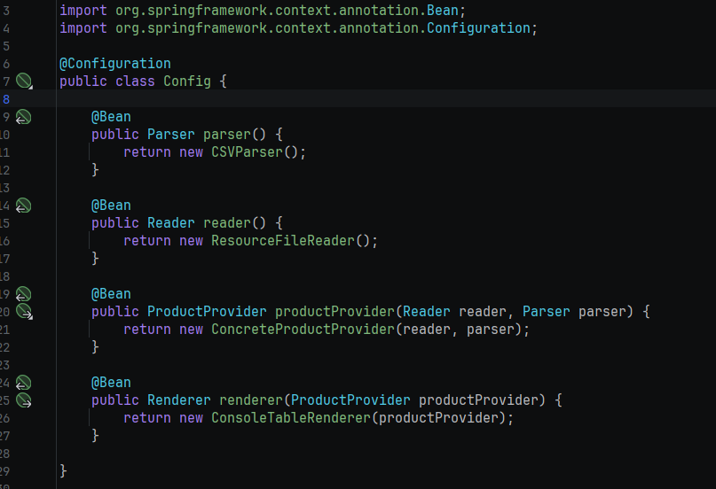
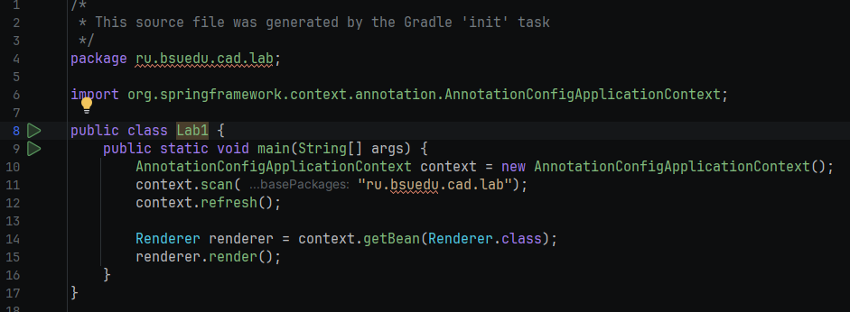
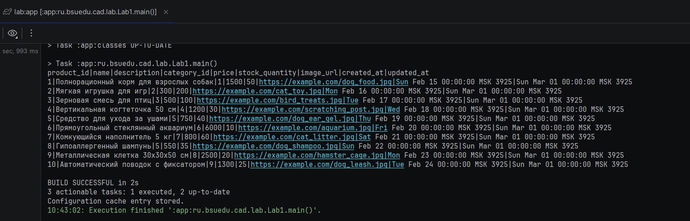

# Отчет о лабораторной работе

## Цель работы
Реализовать приложение должно представлять собой консольное приложение разработанное с помощью фреймворка Spring и конфигурируемое с помощью Java-конфигурации.
## Выполнение работы

Реализовали класс конфигурации

Реализовали точку входа 

Запуск приложения

## Выводы
Научились базовым концепциям Spring Framework