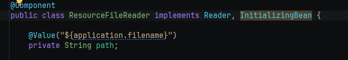
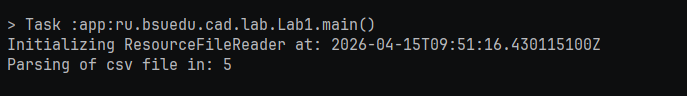

# Отчет о лабораторной работе

## Цель работы

Овладеть навыками АОП, а также продвинутыми возможностями контейнера зависимостей Spring

## Выполнение работы

Реализовали внедрение свойств из файла application.properties

Реализовали аспект

Реализовали HTMLTableRenderer с указанием с помощью аннотации @Primary что именно этот бин в приоритете внедрения

Результат работы программы

## Выводы
Научились использовать АОП, а также научились пользоваться продвинутыми возможностями Spring