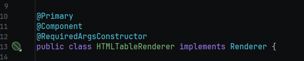
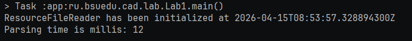
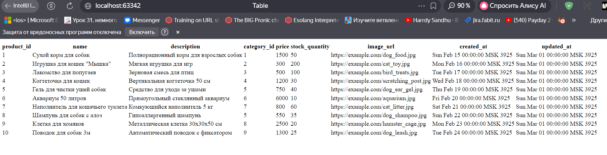
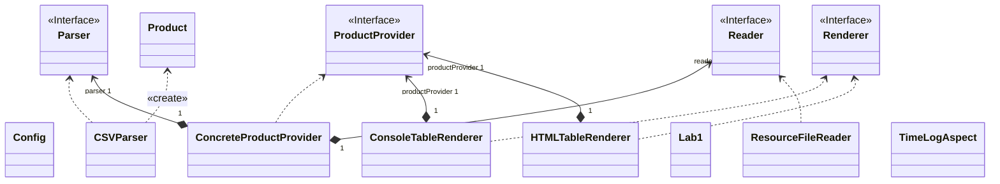

# Отчет о лабораторной работе

## Цель работы
Переделайте приложение так, чтобы его конфигурирование осуществлялось с помощью аннотаций @Component
Использую аннотацию @Value и SpEL сделайте так, чтобы имя файла для загрузки продуктов, приложение получало из конфигурационного файла application.properties. Данный файл поместите в каталог ресурсов (src/main/resources)
Добавьте еще одну имплементацию интерфейса Renderer - HTMLTableRenderer которая выводит таблицу в HTML-файл. Сделайте так, чтобы при работе приложения вызывалась эта реализация, а не ConsoleTableRenderer.
С помощью событий жизненного цикла бина, выведите в консоль дату и время, когда бин ResourceFileReader был полностью инициализирован.
С помощью инструментов AOП замерьте сколько времени тратиться на парсинг CSV файла.
Приложение должно запускаться с помощью команды gradle run, выводить необходимую информацию в консоль и успешно завершаться.
Оформите отчет о выполнении лабораторной работы в виде файла README.md в директории les04/lab. Отчет должен содержать обновленную UML-диаграмму классов в формате mermaid.
## Выполнение работы

Используем @Primary аннотацию для указания контейнеру, что данный бин в приоритете для внедрения зависимостей

Вывод времени инициализации ResourceFileReader и времени парсинга файла в миллисекундах

Сгенерированный HTML file

Диаграмма классов в формате memraid

## Выводы
Научились использовать АОП и изучили продвинутые возможности контейнера зависимостей Spring