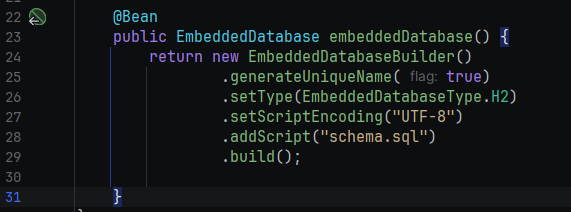
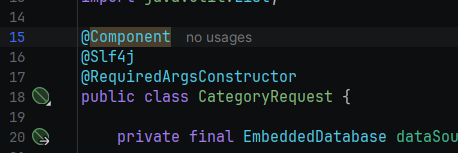
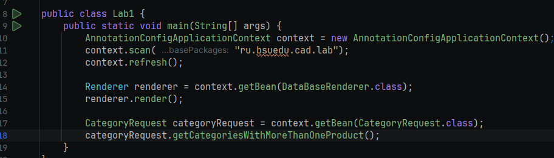
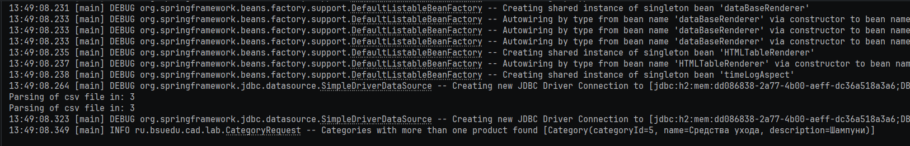

# Отчет о лабораторной работе

## Цель работы

Овладеть навыками работы с JDBC в Spring

## Выполнение работы

Создаем экземпляр встроенной базы данных

Используем аннотацию Slf4j из Lombok для более простого внедрения логгеров

Вызываем DataBaseRenderer и выполняем запрос на получение категорий

Результат выполнения

## Выводы
Научились использовать JDBC для работы с базами данных в проектах