# Отчет о лабораторной работе

## Цель работы

Овладеть навыками работы с JDBC в Spring

## Выполнение работы

Создаем экземпляр встроенной базы данных

Используем аннотацию Slf4j из Lombok для более простого внедрения логгеров

Вызываем DataBaseRenderer и выполняем запрос на получение категорий

Результат выполнения

Диаграмма классов 

```mermaid
classDiagram
direction BT
class CSVParser
class Category
class CategoryProvider {
<<Interface>>

}
class CategoryRequest
class ConcreteCategoryProvider
class ConcreteProductProvider
class Config
class ConsoleTableRenderer
class DataBaseRenderer
class HTMLTableRenderer
class Lab1
class Parser {
<<Interface>>

}
class Product
class ProductProvider {
<<Interface>>

}
class Reader {
<<Interface>>

}
class Renderer {
<<Interface>>

}
class ResourceFileReader
class TimeLogAspect

CSVParser  ..>  Category : «create»
CSVParser  ..>  Parser 
CSVParser  ..>  Product : «create»
CategoryRequest  ..>  Category : «create»
ConcreteCategoryProvider  ..>  CategoryProvider 
ConcreteCategoryProvider "1" *--> "parser 1" Parser 
ConcreteCategoryProvider "1" *--> "reader 1" Reader 
ConcreteProductProvider "1" *--> "parser 1" Parser 
ConcreteProductProvider  ..>  ProductProvider 
ConcreteProductProvider "1" *--> "reader 1" Reader 
ConsoleTableRenderer "1" *--> "productProvider 1" ProductProvider 
ConsoleTableRenderer  ..>  Renderer 
DataBaseRenderer "1" *--> "categoryProvider 1" CategoryProvider 
DataBaseRenderer "1" *--> "productProvider 1" ProductProvider 
DataBaseRenderer  ..>  Renderer 
HTMLTableRenderer "1" *--> "productProvider 1" ProductProvider 
HTMLTableRenderer  ..>  Renderer 
ResourceFileReader  ..>  Reader 

```

## Выводы
Научились использовать JDBC для работы с базами данных в проектах