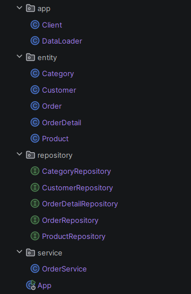
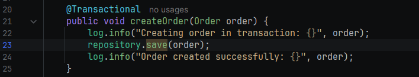
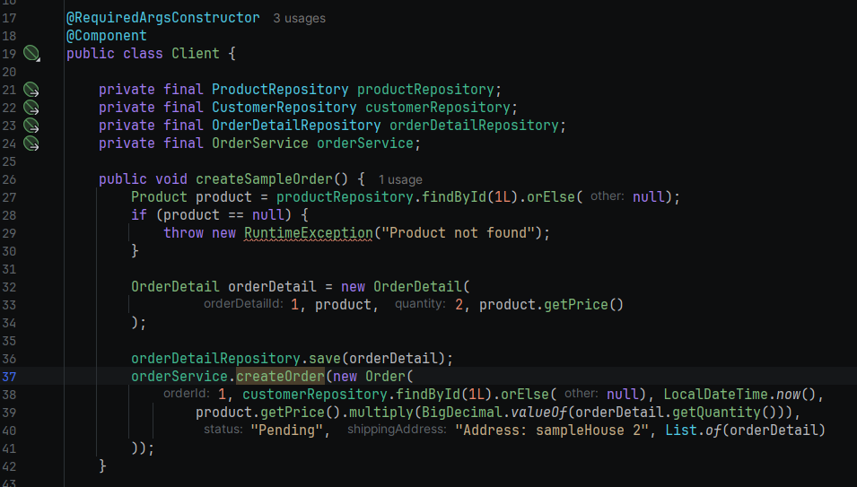
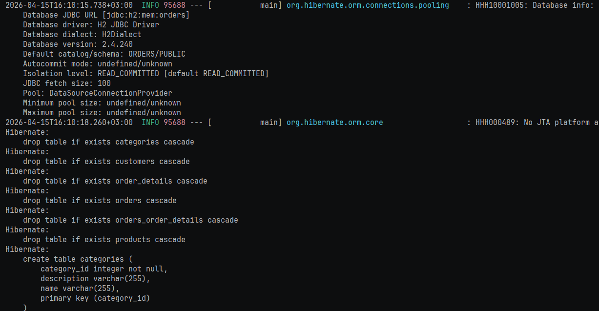
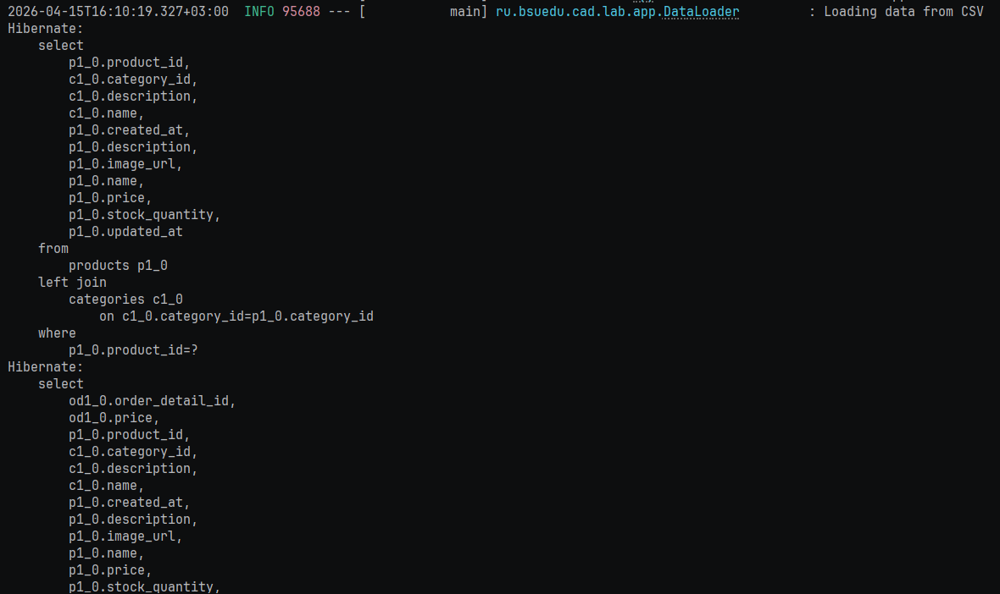
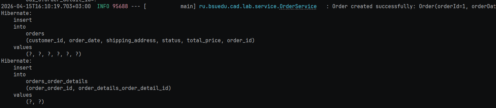
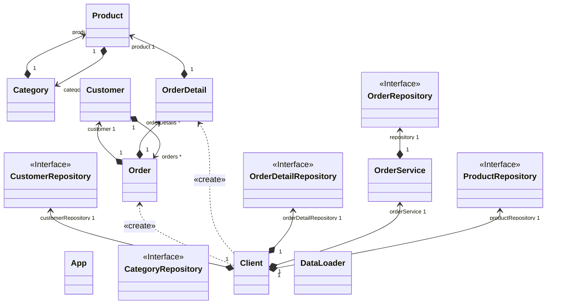

# Отчет о лабораторной работе

## Цель работы
Освоить навыки работы со Spring Data Jpa и слоистой архитектуры приложений
## Выполнение работы

Создали логически раздельные пакеты

Для реализации транзакций использовали аннотацию @Transactional.
Кроме того добавили логгирование

Реализовали клиент для сохранения тестового заказа

При запуске создаются таблицы

При запуске приложения видно, что данные сохраняются в БД из CSV

Видно что данные о заказе сохраняются корректно

Диаграмма классов

## Выводы
Научились использовать Spring Data Jpa, работать с H2 и применили концепцию слоистой архитектуры на практике