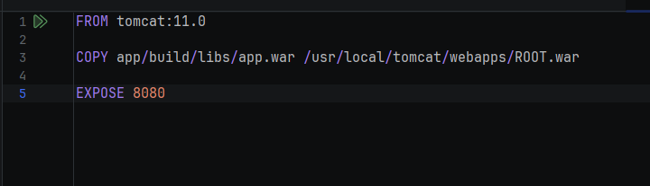
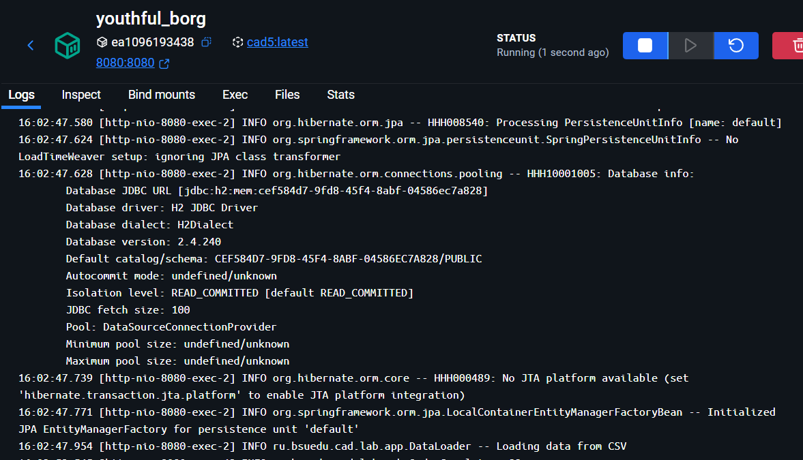
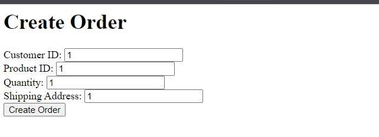
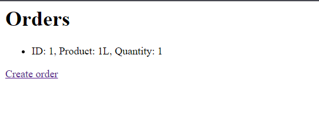
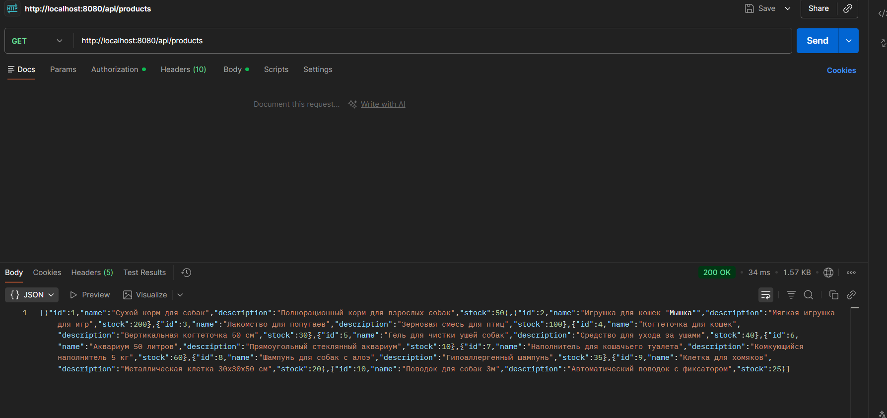
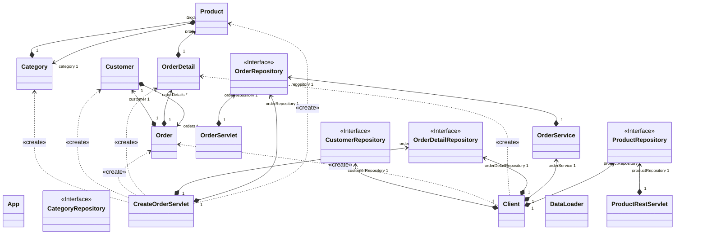

# Отчет о лабораторной работе

## Цель работы
Освоить навыки работы с Jakarta Servlet API 
## Выполнение работы

Создаем образ с Tomcat

Запускаем контейнер

Создаем заказ

Проверяем создаем заказа

Проверяем REST API через Postman

Диаграмма классов

## Выводы
Научились использовать Jakarta Servlet и реализовывать REST API эндпоинты