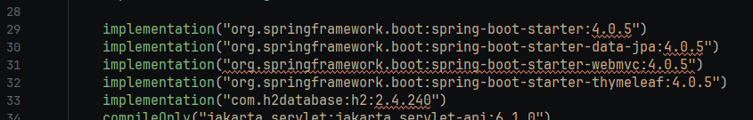
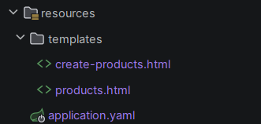
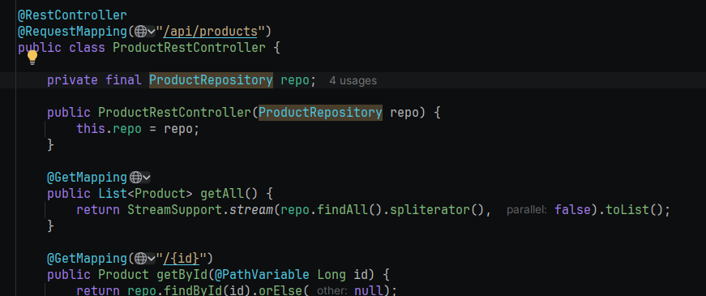
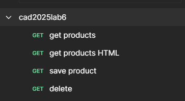
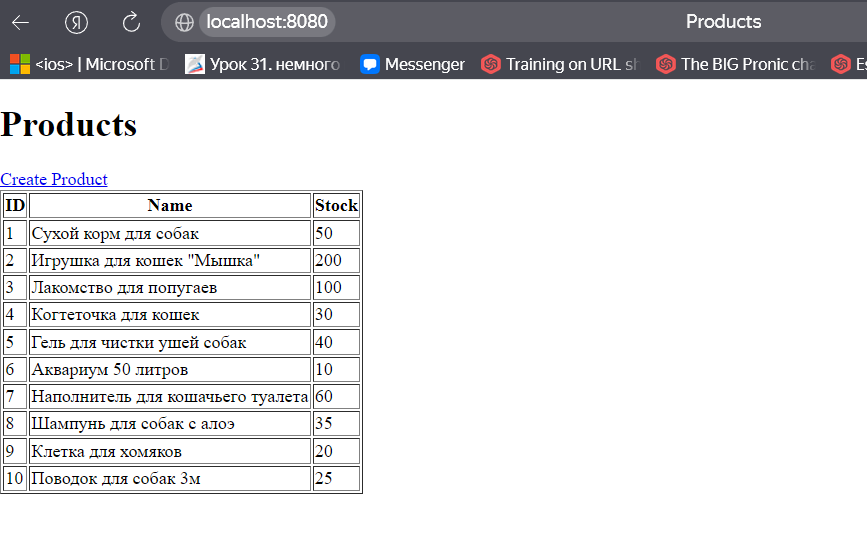
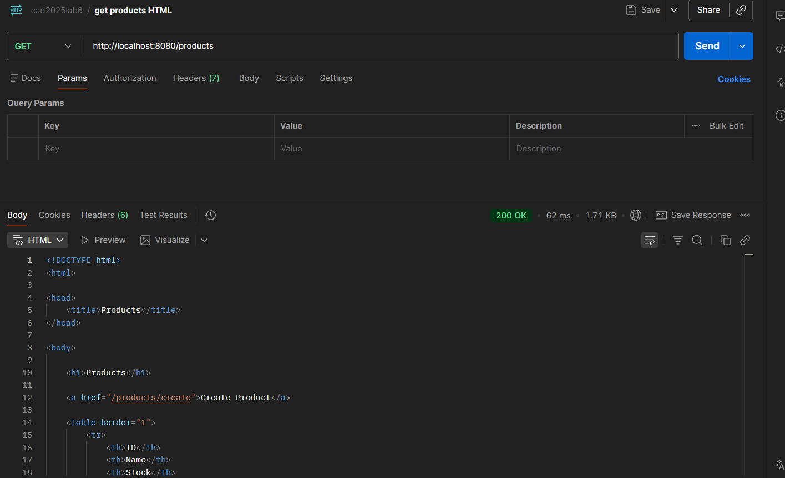
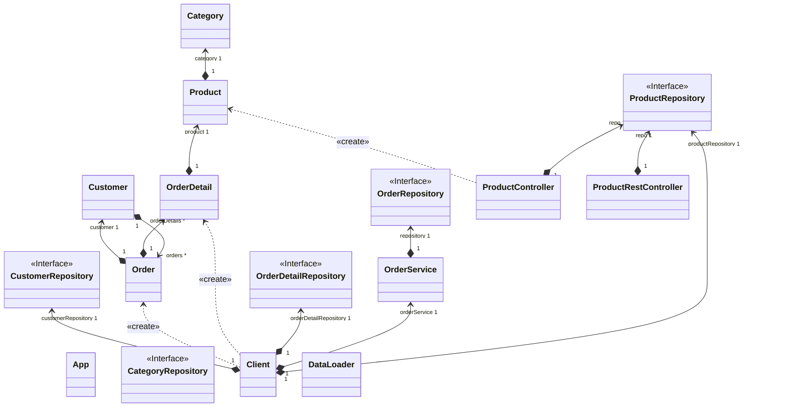

# Отчет о лабораторной работе

## Цель работы
Освоить навыки работы со Spring MVC и Thymeleaf
## Выполнение работы

Добавляем зависимость Thymeleaf 

Создаем шаблоны

Реализовали REST-контроллер

Создаем коллекцию запросов в Postman

Выполняем запросы в браузере

Выполняем запросы в Postman

Диаграмма классов

## Выводы
Научились использовать Thymeleaf и реализовывать Web приложения с помощью Spring MVC