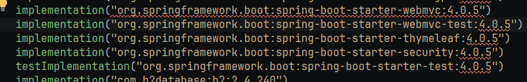
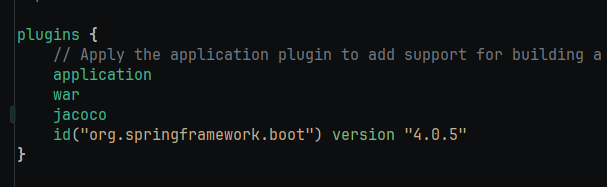
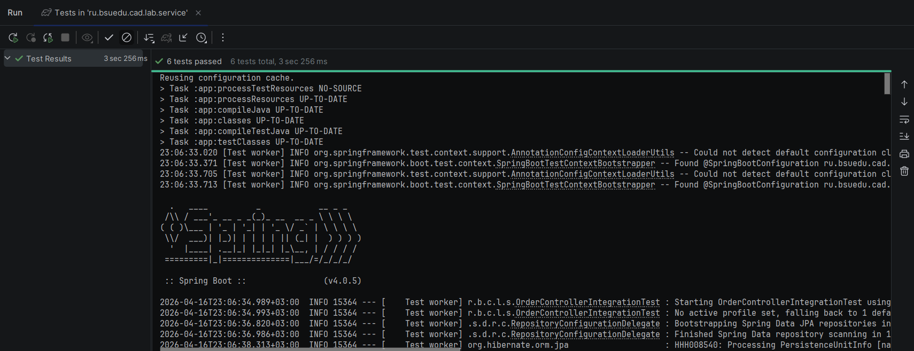
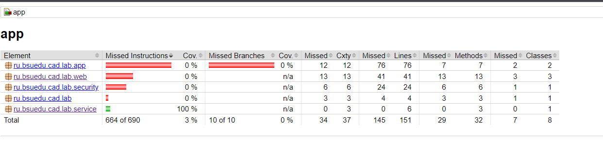
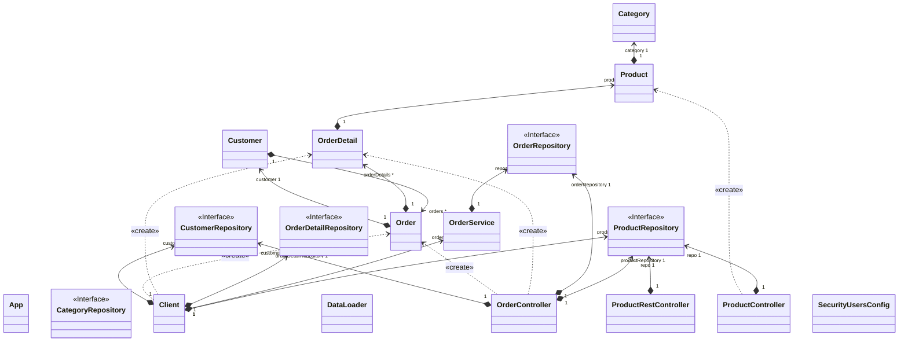

# Отчет о лабораторной работе

## Цель работы
Освоить навыки тестирования приложений
## Выполнение работы

Добавляем зависимость Spring Starter Test и Spring Starter WebMvc Test

Добавляем плагин JaCoCo

Запускаем тесты

Проверяем что JaCoCo сформировал отчет

Диаграмма классов

## Выводы
Научились проводить юнит-тестирование и интеграционное тестирование средствами Spring